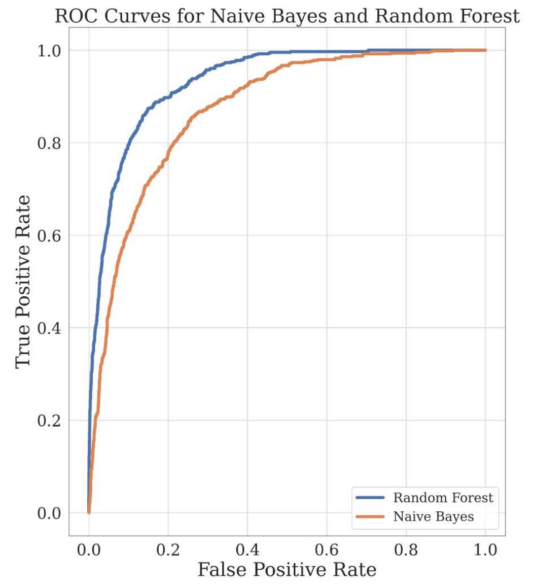

# Online Shoppint Purchasing Intent - Brenner Swenson - City University of London
A comparison of random forest and Naïve Bayes applied to online shoppers purchasing intention dataset

  

### Recreation of Results:
Use MATLAB R2020a
Requires the Statistics and Machine Learning Toolbox to be installed

Each model has three MATLAB files: one file to execute the grid search (do not need to run this as it will take hours), 
a file to train the model with optimised hyperparameters, and another file to load the trained model and evaluate on a test set. 
It is only necessary to load the trained models and then run on the test dataset (that has not been modified).

INSTRUCTIONS TO REPRODUCE MODEL RESULTS:

Naive Bayes:
1. Ensure current working directory contains both test.csv and best_nb_trained.mat
2. Open bayes_test.m 
3. Run file and view performance metrics in the Workspace window

Random Forest:
1. Ensure current working directory contains both test.csv and best_rf_trained.mat
2. Open best_rf_trained.m 
3. Run file and view performance metrics in the Workspace window
